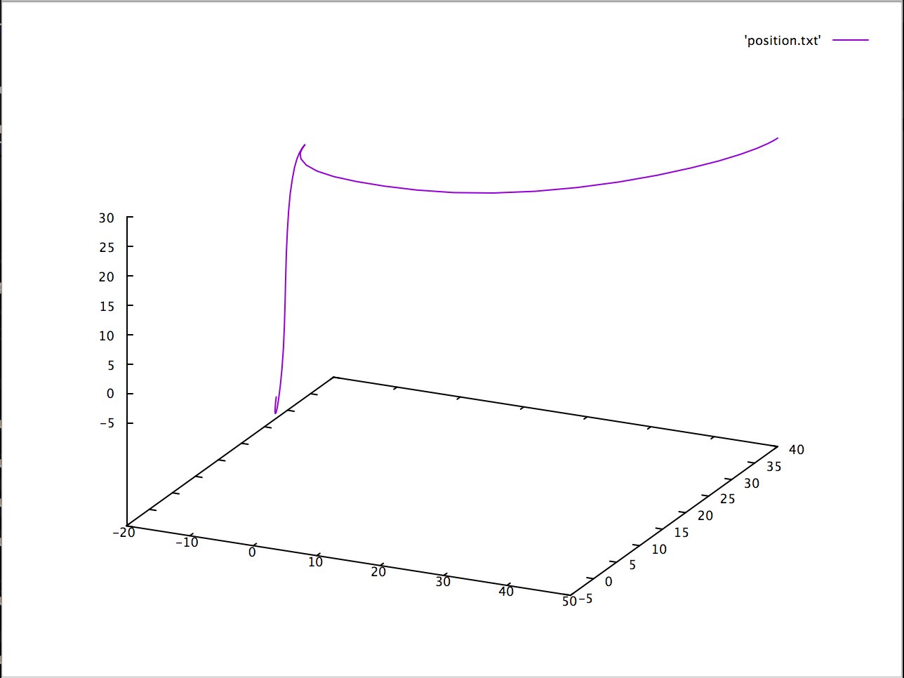

# Trajectory Optimization Library

## Introduction

This is a trajectory optimization library written in an easy-to-understand functional style. It treats the problem as a non-linear one and solves for the entire trajectory as one large optimization problem using [ipopt](https://github.com/coin-or/Ipopt) instead of solving it iteratively per time point.

It is written in a purely function style. The Jacobian and gradients are calculated manually using numerical computing methods and are hand-tuned for performance. The Hessian is approximated by ipopt. The only dependencies are [ipopt](https://github.com/coin-or/Ipopt) and [Rangev3](https://github.com/ericniebler/range-v3) (which is used very sparingly since it didn't turn out to be very performant, at least when this was written.)

The example is located [here](src/trajectoryOptimizationMain.cpp). It optimized a 3-D trajectory, starting from (0,0,0) and ending at (50,40,30), while hitting (-10, 20, 30) along the way, using simple block dynamics. Here are what the results look like:



## Setup

### Third-Party dependencies that will need to be needed

1) [Ipopt](https://projects.coin-or.org/Ipopt)
2) [CMake](https://cmake.org/)
3) [GNUPlot](http://www.gnuplot.info/) (Optional, used for trajectory visualization)

A script `setup.sh` has been provided to install these dependencies on a Mac-based system. It will install Homebrew and use it to install these dependencies. To execute it, run `chmod +x setup.sh && ./setup.sh`.

Linux support has not been added to the script yet.

Note that Rangev3 is cloned and built automatically by CMake, so it does not need to be fetched manually.

### How to use TrajectoryOptimization

TrajectoryOptimization can be easily used as a git submodule in any other CMake-based project. Let's walk through integrating TrajectoryOptimization into an existing source project.

1) cd into your project directory, `git init` if it isn't already a git repository.
2) `mkdir -p lib && git submodule add [insert this project's clone URL (https/ssh)] lib/trajectoryOptimization`
3) If you don't already use CMake, run `touch CMakeLists.txt`. Insert `cmake_minimum_required(VERSION 3.8)` as the first line.
5) Insert these into your `CMakeLists.txt` to import and link the `TrajectoryOptimization::TrajectoryOptimizationLib` target:
```
add_subdirectory(lib/trajectoryOptimization)
add_executable([yourExecutableName] [yourSourceFiles])
target_link_libraries([yourExecutableName]
  PUBLIC
    TrajectoryOptimization::TrajectoryOptimizationLib
)
```
6) `mkdir build && cd build && cmake ..`
7) `make`
8) `./[yourExecutableName]`

Now you can build software using TrajectoryOptimization!

To ever recompile and rerun, just cd into `build/` and run `make && ./[yourExecutableName]`.

### Running tests

To build tests, run cmake like this: `cmake -Dtraj_opt_build_tests=ON ..`. Then cd into `lib/trajectoryOptimization` and run `ctest`.

### Running samples

To build samples, run cmake like this: `cmake -Dtraj_opt_build_samples=ON ..`. Then cd into `lib/trajectoryOptimization` and run `./trajectoryOptimizationSample`. The sample currently optimizes a 3D trajectory. Inspect [the source](src/trajectoryOptimizationMain.cpp) for more information and to learn about usage.

### Notes about Mujoco

Mujoco support is currently baked into this project, but disabled.

To enable building/linking it:
1) Uncomment the relevant lines in [CMakeLists.txt](CMakeLists.txt) that are marked for Mujoco.
2) Copy [this file](cmake/LocalProperties.cmake.sample) to cmake/LocalProperties.cmake and replace the FIXME with the path to your Mujoco installation.
